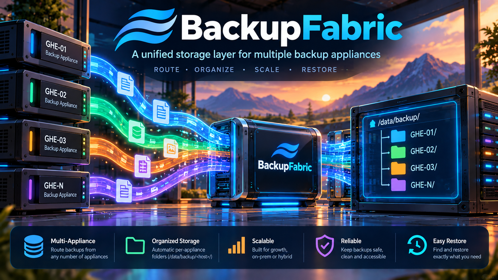

# BackupFabric



A Linux backup hub for receiving, tracking, verifying, and retaining isolated
backup histories. Built first for **GitHub Enterprise Server**; other producers,
such as LAMP stacks, are a planned extension.

**Experimental:** not production-ready. A successful copy is not proof of recovery.

## Quick start

On Linux with Git, Docker Engine, and Docker Compose (Ubuntu 24.04 LTS recommended):

```bash
git clone https://github.com/appatalks/BackupFabric.git && cd BackupFabric && docker compose up --build -d
```

This starts the control plane. Receiver provisioning and source authorization
are separate; a complete automated installer is not available yet.

## What to expect

- A web UI for source topology, received snapshots, and operation history.
- Isolated backup histories, explicit verification, and retained copies.
- Approved operations, not automatic native restore or guaranteed immutability.

## Get started

1. Open **http://127.0.0.1:8080** on the host, or use the [SSH tunnel](readme-2.md#remote-gui-access-over-ssh).
2. Follow [receiver setup](docs/deployment/live-workflows.md) to authorize sources and provision storage.
3. Send a backup, inspect its arrival, then verify and retain it with writers paused.

[Whitepaper (PDF)](docs/whitepaper/BackupFabric-Whitepaper.pdf) · [Technical guide](readme-2.md) · [Roadmap](docs/roadmap.md) · [Apache-2.0 license](LICENSE)
